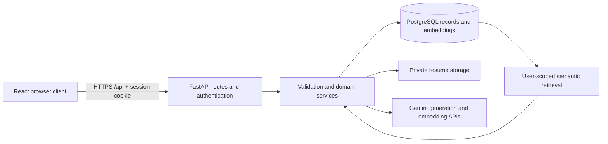

# SkillSync

A full-stack career-preparation application for students: parse a resume, compare its evidence with a target role and job descriptions, ask evidence-grounded questions, and practise text or video interviews.

SkillSync is a final-year engineering project, not a hiring decision system. Scores are documented heuristics and AI-assisted coaching signals—not verified employability probabilities, employer ATS scores, or guarantees of placement.

## Problem statement and motivation

Students often keep resumes, job requirements and interview feedback in separate tools. This makes recurring skill gaps difficult to identify. SkillSync brings those records into one user-owned workspace, with explainable scoring and retrieval-based guidance. Its motivation is to support preparation with traceable evidence rather than an unexplained AI number.

## Key features

- Registration, login, profile setup and HttpOnly-cookie sessions.
- One current PDF resume per user, text extraction and structured section parsing.
- Resume-readiness analysis with deterministic category scores and AI-written feedback.
- Saved job comparisons, matched skills and missing required/preferred skills.
- Career Assistant with user-scoped retrieval, source labels and saved conversations.
- Text and timed video technical, behavioral, resume-based and mixed mock interviews.
- Interview rubric feedback, history and computed final scores.
- Analytics derived from saved records; missing data is not replaced with fabricated metrics.
- Responsive React interface, light/dark themes and keyboard-accessible navigation.

Video responses are recorded and previewed only in the browser. The editable speech transcript is submitted for evaluation; SkillSync does not upload video or infer emotion, appearance or personality from it.

Not implemented: OCR, job applications, recruiter/admin portals, permanent video hosting, autonomous roadmaps, email verification, password recovery or certified ATS integration.

## Architecture



Development uses Vite on port 5173 and FastAPI on port 8000. Vite proxies `/api`. The deployment container builds the same frontend and serves it alongside FastAPI on one origin. No frontend rewrite is required.

## Technology stack

| Layer | Technology and purpose |
| --- | --- |
| Frontend | React 18, JavaScript, Vite, React Router, Tailwind CSS |
| UI | Framer Motion, Lucide icons, React Markdown |
| HTTP | Axios with credentials and centralized error handling |
| Backend | Python 3.12 deployment image, FastAPI, Pydantic, Uvicorn |
| Persistence | PostgreSQL, SQLAlchemy 2, psycopg 3, Alembic migrations |
| Authentication | Argon2 password hashing, PyJWT HS256, HttpOnly cookies |
| Resume parsing | PyMuPDF and deterministic extraction rules |
| AI | Google Gemini structured generation and embedding APIs |
| Retrieval | JSON embedding storage; Python cosine or optional pgvector SQL cosine |
| Verification | pytest, ESLint, Vite build, GitHub Actions configuration |

Versions are declared in `frontend/package.json`, its lockfile and `backend/requirements*.txt`.

## Project structure

```text
frontend/src/
  components/     Shared UI and feature components
  pages/          Routed screens
  layouts/        Marketing, authentication and dashboard shells
  context/        Authentication and theme state
  hooks/          Shared behavior and analytics loading
  services/       API client and feature requests
backend/
  app/api/        Routes and authentication dependencies
  app/core/       Configuration, security, logging and static serving
  app/models/     Relational entities
  app/schemas/    Request/response and AI-output validation
  app/services/   Parsing, scoring, retrieval and workflows
  app/prompts/    Model instructions and structured prompt construction
  alembic/        Versioned database migrations
  tests/          API, security and optional PostgreSQL integration tests
  Dockerfile      Combined frontend-build/backend-runtime image
  serve.py        Production-style Uvicorn entrypoint
deploy/           PostgreSQL and pgvector initialization
docs/             Deployment and RAG architecture documentation
.github/workflows/ci.yml
docker-compose.yml
render.yaml
```

## Local setup

Prerequisites: Node.js 22, Python 3.12, PostgreSQL 17 or another compatible version, and a Gemini API key from Google AI Studio. Commands use PowerShell from the project directory. On Linux/macOS use `cp` instead of `Copy-Item` and `.venv/bin/python` instead of `.venv/Scripts/python.exe`.

### Database setup

Create a development database through an administrative PostgreSQL connection:

```sql
CREATE DATABASE skillsync;
```

Set your own credentials in `backend/.env`. Do not reuse a development administrator account in production. Tables are created with Alembic, not by starting the API.

### Running the backend

```powershell
cd backend
Copy-Item .env.example .env
python -m venv .venv
.venv/Scripts/python.exe -m pip install -r requirements.txt -r requirements-dev.txt
python -c "import secrets; print(secrets.token_hex(32))"
```

Set the generated value as `JWT_SECRET` in `.env`, set `DATABASE_URL` to your PostgreSQL database, and add the Gemini key as `GEMINI_API_KEY`. Then:

```powershell
.venv/Scripts/python.exe -m alembic upgrade head
.venv/Scripts/python.exe -m uvicorn app.main:app --reload --port 8000
```

Development API documentation: `http://localhost:8000/api/docs`. Liveness: `/api/health`. Database/vector readiness: `/api/ready` (does not test model availability or migration completeness).

### AI provider

Create a Gemini API key in [Google AI Studio](https://aistudio.google.com/apikey) and place it only in `backend/.env`. The backend uses `gemini-3.1-flash-lite` for structured generation and `gemini-embedding-001` with 768 dimensions for retrieval. AI features require internet access; provider failure produces a controlled error rather than a fabricated successful result.

### Running the frontend

In a separate terminal, from the project directory:

```powershell
cd frontend
Copy-Item .env.example .env
npm ci
npm run dev
```

Open `http://localhost:5173`. Use the same hostname consistently while testing cookies. Register, complete the profile, upload a readable PDF, then run an analysis.

## Environment variables

Complete defaults are in [backend/.env.example](backend/.env.example) and [frontend/.env.example](frontend/.env.example). Root [.env.example](.env.example) is only for Compose.

| Variable | Purpose / production rule |
| --- | --- |
| `APP_ENV` | `development`, `test`, or `production`; production requires HTTPS origin and secure cookies |
| `DATABASE_URL` | Secret PostgreSQL URL; hosted `postgres://` and `postgresql://` normalize to psycopg |
| `JWT_SECRET` | Generated random secret, minimum 32 characters; never publish |
| `FRONTEND_ORIGIN` | One exact origin, e.g. `https://your-app.example`; no paths or wildcard |
| `AUTH_COOKIE_SECURE` | `true` for HTTPS production, `false` for local HTTP |
| `ACCESS_TOKEN_EXPIRE_MINUTES` | Session-token lifetime, default 60 |
| `AUTH_REQUESTS_PER_MINUTE` | Per-process, per-client auth throttle, default 20 |
| `MAX_API_BODY_KB` | Non-upload body budget, default 128 |
| `RESUME_STORAGE_DIR` | Private persistent storage; Docker uses `/app/storage/resumes` |
| `MAX_RESUME_SIZE_MB`, `MAX_RESUME_PAGES` | PDF limits: 5 MB and 50 pages |
| `GEMINI_API_KEY` | Backend-only Google AI Studio key; never expose through `VITE_*` |
| `GEMINI_MODEL` | Structured-generation model; default `gemini-3.1-flash-lite` |
| `GEMINI_EMBEDDING_MODEL` | Retrieval embedding model; default `gemini-embedding-001` |
| `AI_TIMEOUT_SECONDS` | Per-provider-call budget, default 120; not an end-to-end guarantee |
| `RAG_VECTOR_BACKEND` | `python` default; `pgvector` requires enabled extension |
| `RAG_EMBEDDING_DIMENSIONS` | Default 768; must match model output |
| `RAG_CHUNK_SIZE`, `RAG_CHUNK_OVERLAP` | Character-based chunking: 900 / 120 |
| `RAG_TOP_K`, `RAG_MAX_CONTEXT_CHARACTERS` | Retrieval budgets: 6 / 8000 |
| `RAG_HISTORY_LIMIT`, `RAG_MIN_SIMILARITY` | History count 8, cosine threshold 0.2 |
| `LOG_LEVEL` | `INFO` default; process output logs |
| `FRONTEND_DIST_DIR` | Optional built SPA directory, set by Docker |
| `PORT`, `FORWARDED_ALLOW_IPS` | Read by `serve.py`; trust only known proxy addresses |
| `VITE_API_URL` | Public build-time frontend value, default `/api`; never an API key |

Additional output and interview limits are in the backend example. No alternate provider adapter is implemented: setting unrelated provider keys will not enable one.

## AI and RAG architecture

Resume parsing is deterministic, not an LLM operation. Analysis sends bounded data plus fixed scores to Gemini; Pydantic validates the response before saving.

For Career Assistant questions, profile/resume/analysis/job records become owner-tagged documents and overlapping chunks. Fingerprints avoid regenerating unchanged embeddings. Questions use the same embedding model. Only chunks whose owner **and parent document owner** match the authenticated user are candidates. A similarity threshold, per-document cap and context budget select evidence. The prompt adds bounded history and the question; responses carry validated source references. Grounding is improved, not guaranteed.

Two retrieval modes preserve the same API and JSON-stored vectors:

- `python`: exact cosine similarity in application code, compatible with existing installs.
- `pgvector`: casts JSON to PostgreSQL `vector` expressions and ranks exact cosine similarity in SQL. No native vector-column migration or HNSW/IVFFlat index exists. It still scans eligible chunks; do not claim large-scale retrieval performance.

See the detailed [RAG architecture](docs/RAG_ARCHITECTURE.md).

## Scoring approaches

### Resume analysis

Five rule-based categories contribute up to 20 points each: skills relevance, project quality, experience relevance, completeness, and clarity/structure. The model supplies qualitative feedback, not the score. Cached analyses depend on resume/profile inputs, rubric and model; explicit reruns preserve history.

### Job matching and skill gaps

The model extracts requirements. Backend rules calculate required skills (40), preferred skills (15), experience (15), education (10), and project relevance (20). Project relevance combines keyword overlap (8) and embedding similarity (12). Its semantic contribution maps cosine using `clamp((similarity - 0.25) / 0.55, 0, 1)` before weighting. Displayed alignment explanations and recommendations are derived from the same backend evidence, rather than a separate model narrative. These are design choices, not calibrated hiring predictions.

Gaps are normalized required/preferred skills without supporting resume matches. Analytics count recurring gaps across saved comparisons, not independently validated competence. Extraction and embeddings still affect the score even though arithmetic is deterministic.

### Interview evaluation

The model assigns 0–4 ratings for accuracy, relevance, clarity, completeness and communication. The backend multiplies each by five and sums question scores. The final score is the rounded average of answered-question scores. Deterministic arithmetic does not make AI ratings objective or bias-free.

Video mode adds a 30-second preparation timer, a two-minute browser recording window, local playback and browser speech recognition. Candidates can correct the transcript before submitting it to the existing evaluation endpoint. Recordings remain in browser memory and are discarded when the answer is submitted, retaken or the page is closed. The browser speech service may process microphone audio and may require a network connection; support and accuracy vary, so manual transcript editing remains available.

## Security considerations

Argon2 password hashes; signed, expiry-checked JWTs in HttpOnly, SameSite=Lax cookies, Secure in production; owner-scoped queries; exact-origin CORS and unsafe-request Origin checks; bounded requests, PDFs and prompts; validated model outputs. Resume files remain private, outside the static frontend directory. Request logs use route templates, status, duration and generated IDs, not submitted text or cookies.

Remaining needs include shared rate limits, trusted-proxy configuration, token revocation, password recovery, upload sandboxing, retention/erasure policy and human review of AI output. See the current [deployment guide](docs/DEPLOYMENT.md).

## Docker and deployment

The [deployment guide](docs/DEPLOYMENT.md) covers Compose, a zero-cost demonstration topology using Render, Neon PostgreSQL and Gemini, pgvector, migrations and rollback. `render.yaml` is preparation, not evidence of a live deployment. Review current provider limits before provisioning.

## Verification

```powershell
cd backend
.venv/Scripts/python.exe -m pytest tests -q
```

From `frontend`, run `npm run lint` and `npm run build`. GitHub Actions is configured to run those checks, apply migrations to disposable PostgreSQL, test pgvector integration, and build the container.

## Known limitations

AI quality depends on model and input quality. Scanned PDFs have no OCR; complex formatting can misparse. Provider calls are synchronous and may outlast browser/hosting limits. Video capture requires camera/microphone permission and MediaRecorder support; automatic transcription depends on browser speech recognition. Retrieval and histories need indexing/pagination as data grows. Render's free filesystem is ephemeral, so hosted raw PDFs do not survive restarts; parsed database records do. SQLite tests do not replace PostgreSQL, browser, load or security testing.

## Future improvements

Queued AI jobs with progress, opt-in private video storage, provider-backed transcription, shared throttling, full data erasure, password recovery, OCR, curated evaluation datasets, accessibility audits and native indexed vector storage. These are proposals, not features.

## Author

Piyush Kumar — [piyush00455@gmail.com](mailto:piyush00455@gmail.com)

Institution, supervisor, submission year and institution-approved license remain to be added. No invented institution details, results, screenshots or live URLs are included.
